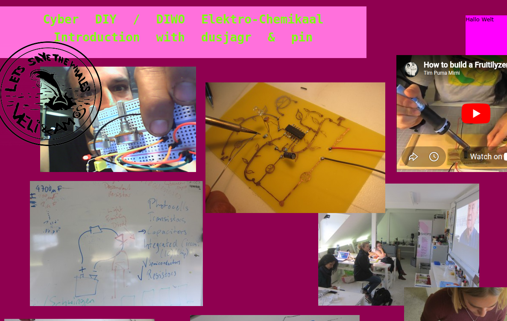
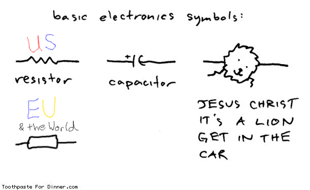
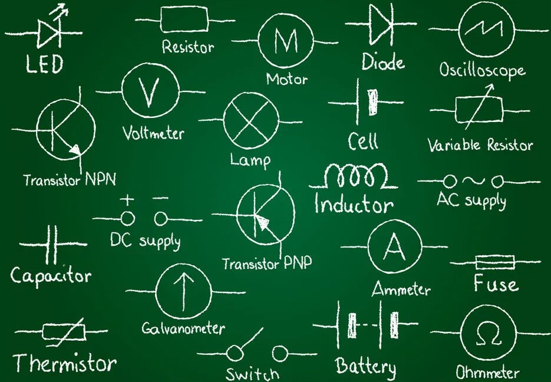
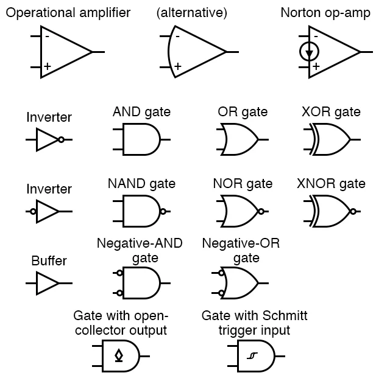
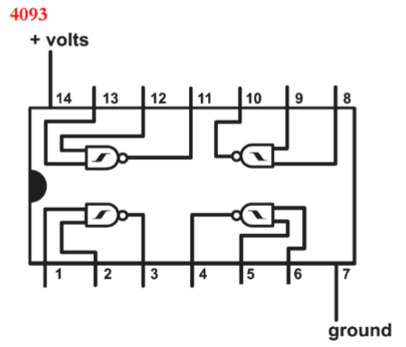
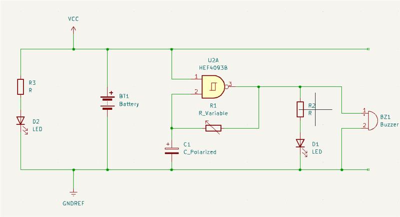
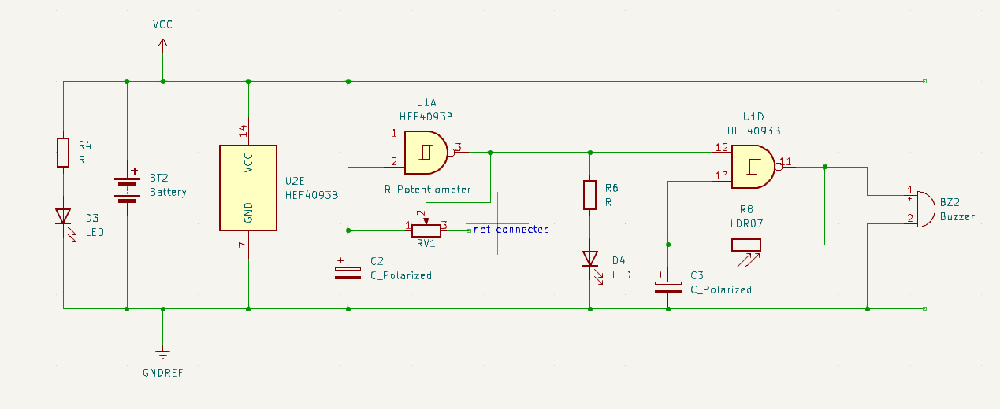

# DIY Electronics

*Click on image to see more*

## Motivation
- [DIY Festival - do it yourself Kultur](https://www.youtube.com/watch?v=5yKIn0ASaGo=) good old times, >
- [NAND gate to make music!](https://github.com/arai-eek/forever4093geeking)
- [dusjagr's hotglue on DIY electronics](https://dusjagr.hotglue.me/)

## Basics

_It's a lion!_ 

modified from https://makezine.com/article/craft/electronics-levity/

from https://www.ic-components.com/blog/100-circuit-symbols-and-names-to-help-you-with-your-next-project.jsp

## Logic Gates and 4093 IC

from https://www.allaboutcircuits.com/textbook/reference/chpt-9/integrated-circuits/

from https://docs.cirkitdesigner.com/component/0a253d56-19f9-4640-a31c-6bfbd8d9908b/4093

## Challenge 
- Build a NAND oscillator and make some noise!
- Will be described on the black board during class...
- Some badly documented stuff is in the [J'aime wiki](https://www.hackteria.org/wiki/J%27aime_4093_Nandsynth#Vive-la-Restistance)

## Simple 4-NAND oscillator

